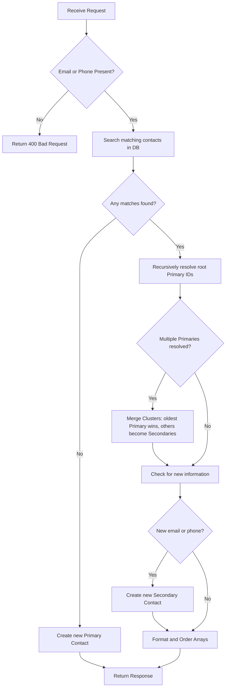

# Zamazon Identity Engine — Project Documentation & Specification

Welcome to the comprehensive technical documentation for the **Zamazon Identity Engine**. This document details the engineering specifications, architectural decisions, and algorithm implementations for the Identity Reconciliation Service.

---

## 1. Executive Summary

In modern full-stack web architectures, users often interact with platforms using fragmented contact details (e.g., different email addresses or phone numbers across multiple checkouts or logins). 

The **Zamazon Identity Engine** is a high-throughput, transaction-safe identity reconciliation service. Given a stream of `/api/identify` requests carrying an `email` and/or `phoneNumber`, it consolidates fragmented records into exactly **two-level deep identity clusters**:
1.  **Primary Contact:** The root representation of a physical person (the oldest record).
2.  **Secondary Contacts:** Auxiliary records (newer emails/phones) linked directly to the parent primary.

By resolving these relationships in real time, the engine provides a unified view of customer identities, enabling accurate user tracking, merged shopping histories, and profile linking.

---

## 2. Technical Stack

*   **Next.js 14 (App Router):** Leveraged for high-performance React server components and dynamic Serverless API routing.
*   **TypeScript (Strict Mode):** Used to enforce strict compile-time type safety across the algorithm and UI data schemas.
*   **Tailwind CSS:** Utilized to build a premium, responsive dark-themed administration console and interactive playground.
*   **MongoDB Atlas:** Distributed cloud replica set database providing document storage and transaction support.
*   **Prisma ORM (v6):** Employed for schema definition, database queries, indices, and type-safe database access.
*   **Vitest:** Integration testing framework executing concurrent validation scenarios.

---

## 3. Database Schema Design

The system uses a self-referencing relationship in MongoDB to build identity graphs. The graph is restricted to exactly **two levels** (one primary parent, and $N$ secondary children pointing directly to it).

### 3.1 Prisma Schema (`prisma/schema.prisma`)
```prisma
enum LinkPrecedence {
  primary
  secondary
}

model Contact {
  id             String         @id @default(auto()) @map("_id") @db.ObjectId
  phoneNumber    String?
  email          String?
  linkedId       String?        @db.ObjectId // Foreign Key to parent
  linkedContact  Contact?       @relation("ContactLinks", fields: [linkedId], references: [id], onDelete: NoAction, onUpdate: NoAction)
  secondaryLinks Contact[]      @relation("ContactLinks")
  linkPrecedence LinkPrecedence @default(primary)
  createdAt      DateTime       @default(now())
  updatedAt      DateTime       @updatedAt
  deletedAt      DateTime?

  @@index([email])
  @@index([phoneNumber])
  @@index([linkedId])
}
```

### 3.2 Index Optimization
To support high-throughput lookups, indexes are established on the fields queried during the matching phase:
*   `Contact_email_idx`: Optimizes searches by email.
*   `Contact_phoneNumber_idx`: Optimizes searches by phone number.
*   `Contact_linkedId_idx`: Accelerates queries fetching all secondary children linked to a primary contact.

---

## 4. The Reconciliation Algorithm (`/api/identify`)

The core algorithm resolves identity clusters in 5 logical steps:



### 4.1 Step-by-Step Logic

1.  **Request Validation:** Uses Zod to validate input fields. Number types in `phoneNumber` are coerced to strings.
2.  **Match Lookup:** Queries the database for active contacts (`deletedAt: null`) that match either the incoming `email` or `phoneNumber`.
3.  **Root Resolution:** For each matching contact, the engine recursively walks its parent `linkedId` pointer to find the root `primary` contact. If a contact is already a primary, it resolves to itself. 
4.  **Cluster Merging (Critical Edge Case):**
    *   If matches span multiple distinct primary clusters, they must be unified.
    *   The **oldest** primary contact (by `createdAt` timestamp) is preserved as the single `primary` contact of the merged cluster.
    *   All younger primary contacts are flipped to `secondary` precedence, and their `linkedId` is updated to point to the oldest primary.
    *   Any secondary contacts originally linking to the younger primaries are cascade-repointed to point directly to the oldest primary.
5.  **New Information Insertion:**
    *   The engine checks if the incoming request introduces a new `email` or `phoneNumber` not already represented inside the resolved cluster.
    *   If new information exists, a new `secondary` contact is created, linking to the primary.
    *   If the request is an exact byte-for-byte duplicate of data already in the cluster, no new record is created (short-circuit).

---

## 5. Concurrency & Race Conditions

In high-concurrency environments, two identical requests for a new customer might execute simultaneously. Without locking, both requests would check the database, find no matches, and create two separate `primary` contacts for the same person (violating identity uniqueness).

### 5.1 Retry-On-Conflict Strategy
To resolve this:
1.  The find-then-create code is enclosed inside a Prisma interactive database transaction (`prisma.$transaction`).
2.  The transaction executes on a MongoDB replica set.
3.  We wrap execution in a retry block (`executeWithRetry`):
    ```typescript
    async function executeWithRetry<T>(fn: () => Promise<T>): Promise<T> {
      let attempt = 0;
      while (true) {
        try {
          return await fn();
        } catch (error: any) {
          attempt++;
          const isTransientError = error.code === 112 || error.message.includes("WriteConflict");
          if (isTransientError && attempt < MAX_RETRIES) {
            await new Promise((resolve) => setTimeout(resolve, Math.random() * 100));
            continue;
          }
          throw error;
        }
      }
    }
    ```
4.  If a write conflict occurs, MongoDB aborts one of the transactions. Our handler catches the conflict, waits a random delay to prevent live-locks, and retries. During the second attempt, the match lookup successfully finds the primary contact created by the winning transaction, preventing duplicate parent creation.

---

## 6. Verification and Test Scenarios

We verified the engine against 10 distinct test cases:

1.  **First-ever request** creates a primary contact.
2.  **Request sharing only email** creates a secondary contact.
3.  **Request sharing only phone** creates a secondary contact.
4.  **Request with only email matching** returns the cluster without duplicating records.
5.  **Request with only phone matching** returns the cluster without duplicating records.
6.  **Merging separate clusters** (verifies that the oldest primary survives and younger elements cascade-relink).
7.  **Exact duplicate request** does not insert duplicate rows.
8.  **Empty request** returns `400 Bad Request` with an `INVALID_REQUEST` envelope.
9.  **Type coercion** successfully handles numbers passed as phone inputs.
10. **Concurrent execution** verifies that simultaneous inputs do not spawn duplicate primaries.

---

## 7. How to Export this to PDF

You can easily save this documentation as a PDF for sharing:
1.  Open the accompanying file **[PROJECT_DOCUMENTATION.html](file:///d:/proj d/PROJECT_DOCUMENTATION.html)** in any web browser (Chrome, Edge, Safari).
2.  Press **`Ctrl + P`** (or **`Cmd + P`** on Mac) to open the print dialog.
3.  Set the printer destination to **`Save as PDF`**.
4.  Enable **Background graphics** and click **Save**.
